## Learnings from Unit 10: Timeseries Analysis

### Definitions
**Machine Learning** is a programming approach allowing applications to learn from their inputs and make adjustments based on their outputs. In a nutshell, machine learning, is developing statistical models that can make predictions or decisions on new data automatically

**Time Series Decomposition** is the separation of a time series into useful and less useful components  

**Exponentiall Weighted Moving Average (EWMA)** is an approach used to "denoise" or "smooth" out time series data so that trends and predictions can be made

**Hodrick-Prescott Filter** is a mathematical function that separates a time series into trend and non-tend components.

**Autocorrelation** is a measure of how closely current values correlate with past values.

**Stationarity** is a process where the mean and variance are constant across time

**A Non-stationary process** has an upward or downward trend

**Auto-Regressive(AR) Models** assumes some degree of autocorrelation while using past values to predict future values.

**Moving Average Models** us past errors plus current error to predict future values

**Auto-Regressive Integrated Moving Average (ARIMA)** combines features of AR and MA models by using past values and errors to predict future values. 

**Akaike Information Criterion(AIC)** is an estimator of out-of-sample prediction error and thereby relative quality of statistical models for a given set of data.[1][2] Given a collection of models for the data, AIC estimates the quality of each model, relative to each of the other models. Thus, AIC provides a means for model selection.

**Bayesian Information Criterion(BIC)** is a criterion for model selection among a finite set of models; the model with the lowest BIC is preferred. It is based, in part, on the likelihood function and it is closely related to the Akaike information criterion (AIC).

**Volatility:** Amount of variance across a time series

**Heteroskedasticity:** uneven variance

**Generalized Autoregressive Conditional Heteroskedasticity (GARCH) models** are made up of auto-regressive and moving average components and are used to predict volatility

**Linear Regression** finds the line that best describes the Data

**Multiple Regression** attempts to model the relationship between two or more explanatory variables and a response variable by fitting a linear equation to observed data.

**A parsimonious model** is a model that accomplishes a desired level of explanation or prediction with as few predictor variables as possible.

**Mean Squared Error (MSE)** tells you how close a regression line is to a set of points. It does this by taking the distances from the points to the regression line (these distances are the “errors”) and squaring them. ... It's called the mean squared error as you're finding the average of a set of errors.

**Root Mean Squared Error (RMSE)** is the standard deviation of the residuals (prediction errors). Residuals are a measure of how far from the regression line data points are; RMSE is a measure of how spread out these residuals are. In other words, it tells you how concentrated the data is around the line of best fit.

**In statistics, the coefficient of determination, denoted R² or r²**and pronounced "R squared", is the proportion of the variance in the dependent variable that is predictable from the independent variable.

**Transpose** is a matrix obtained from a given matrix by interchanging each row and the corresponding column.
    
### Libraries
    1. statsmodels - [.api, .tsa.arima_model], [ARMA, ]
    2. arch - [arch_model]
    3. sklearn- [.linear_model], [LinearRegression, mean_squared_error, r2_score]

### Functions
    1. Pandas DateTimeIndex index (Ex: df.loc[2019] )
    2. Pandas Resample Function (Ex: weekly = df['Close'].resample('W').mean() )
    3. Pandas shift function to get lagged returns (Ex: df.returns.shift())
    4. fit function (Ex: results = model.fit() )
    5. forecast function (Ex: results.forecast())
    6. df.T
    7. Linear Regression Function (Ex: model = LinearRegression() )
    8. Predict Function (Ex: predictions = model.predict(X_train))
    
    
### Concepts
    1. Machine Learning can be used to predict:
        - Loan eligibility, foreclosure rates, and fraud
        - Disease Diagnosis and prognosis
        - consumer segmentation and clustering
        - Presidential election results
        - Natural disaster and planetary climate impacts
        
    2. Machine Learning Models
        - 01 - Libraries are provided for python
        - 02 - Machine Learning Pipelines
            - Paradigm: Model --> Fit --> Predict
            - Once model is fit it can be used for predictions  
            
    3. Intellegent Algorithms
        - Intelligent algorithms are ones that use data to modify its behavior. Intelligent algorithms differ in that they can change their behavior as they run, othen resulting in a user experience that many would say is intelligent.
        - Intelligent algorithms are ones that respond to data such that the algorithm gets better. It effectively "evolves" The decision is no longer deterministic given the event. 
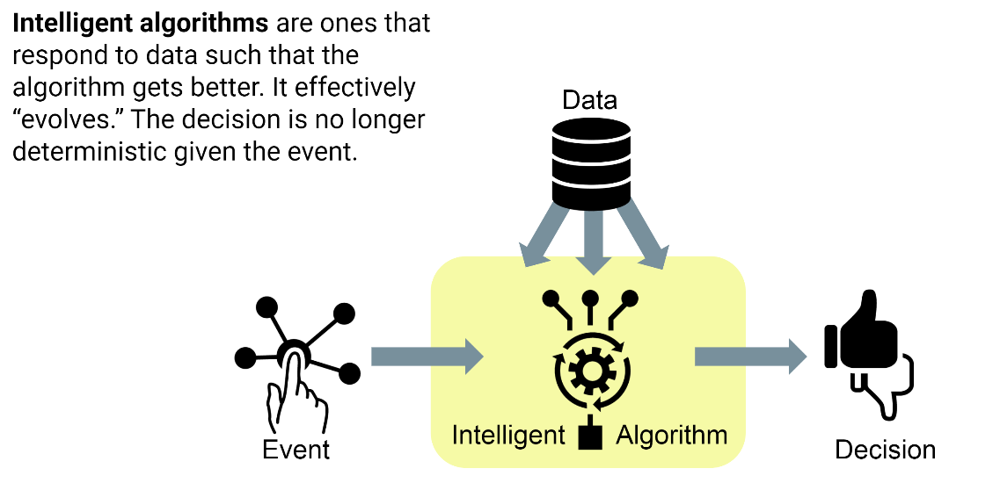

    4. ML Triangle
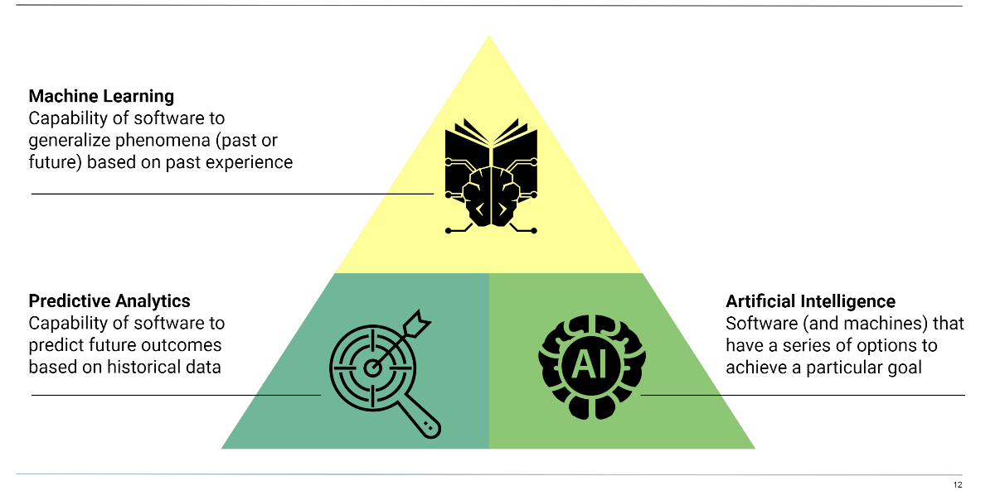    

    5. Predictive Analytics Flow Chart     
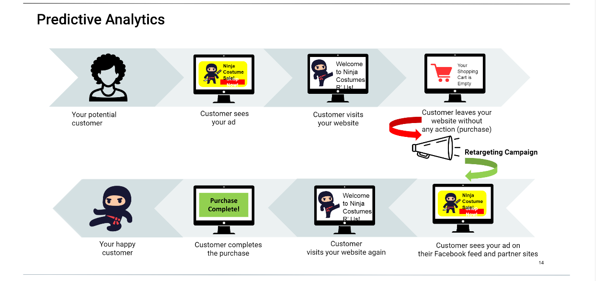

    6. Types of ML
        - Unsupervised Learning
            - Dimensionality Reduction
                - Meaningful Compression, Gid Data Visualization, Structure Discovery, Feature Elicitation
            - Clustering
                Recommender Systems
                Tageted Marketing
                Customer Segmentation
        - Supervised Learning
            - Regression
                - Population Growth Prediction, Advertising Popularity Prediction, Weather Forecasting, Market Forecasting, Estimating Life Expectancy
            - Classification
                - Image Classification, Identity Fraud Detection, Customer Retention, Diagnostics
        - Reinforcement Learning
            - Real-Time Decisions, Robot Navigation, Game AI, Skill Acquisition
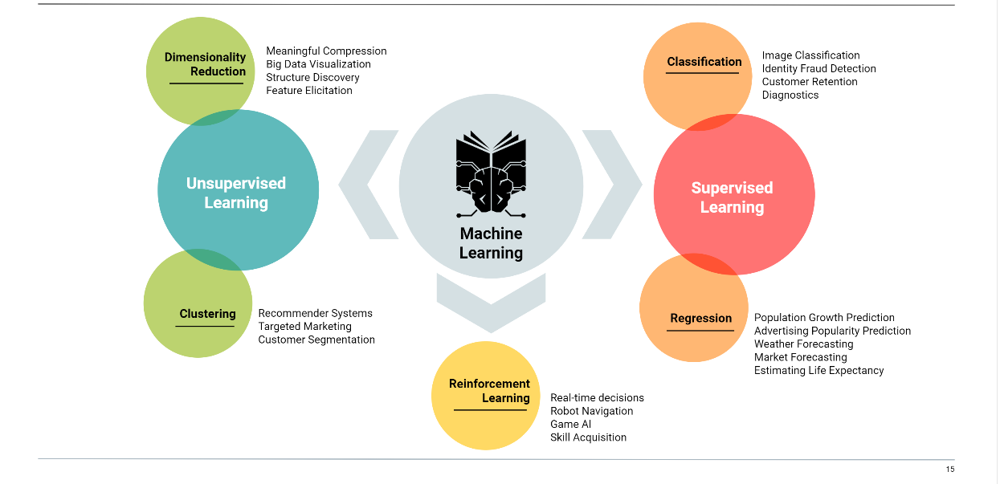

    7. Time Series Decomposition
        - Overview
            - Separation of a time series into useful and less useful components
            - The useful components can be used to observe patterns and make predictions.
            
        - Decomposition Components
            - 01 - Level: What is the average value of the series?
            - 02 - Trend: Is there an overall direction of mevement?
            - 03 - Periodicity: Do patterns occur in cycles?
            - 04 - Residual: How much noise exists in the data?
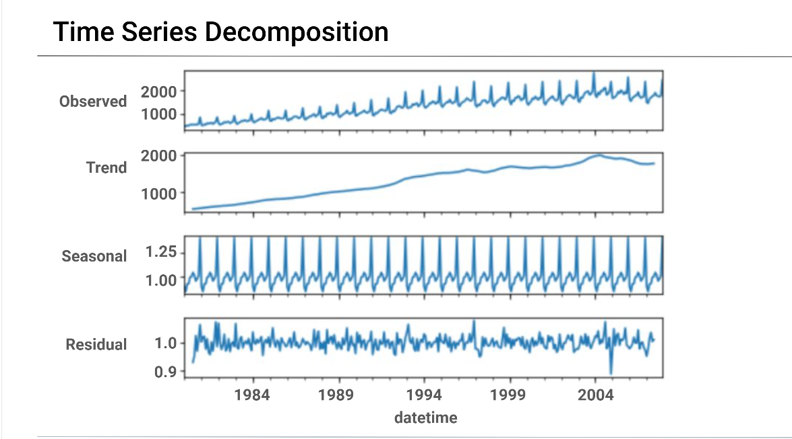

        - Exponentiall Weighted Moving Average (EWMA)
            - 01 - EWMA involves calculating the average of the last n prices
            - 02 - Weights are added to the averages based on the recency of the data. Recent data is weighted more heavily. Weighting decreases exponentially for previous prices/time periods
            - 03 - Requires past average values to be stored in memory
            
        - Hodrick-Prescott Filter
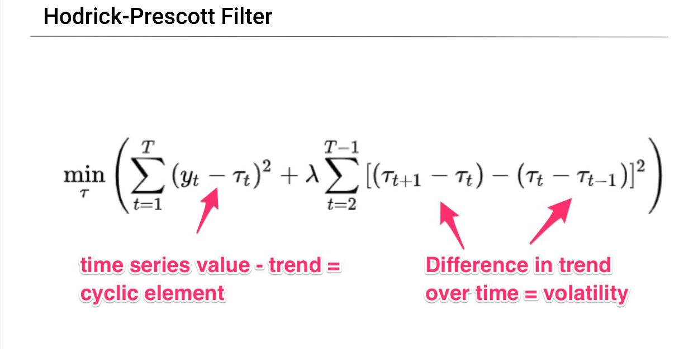  

        - Autocorrelation
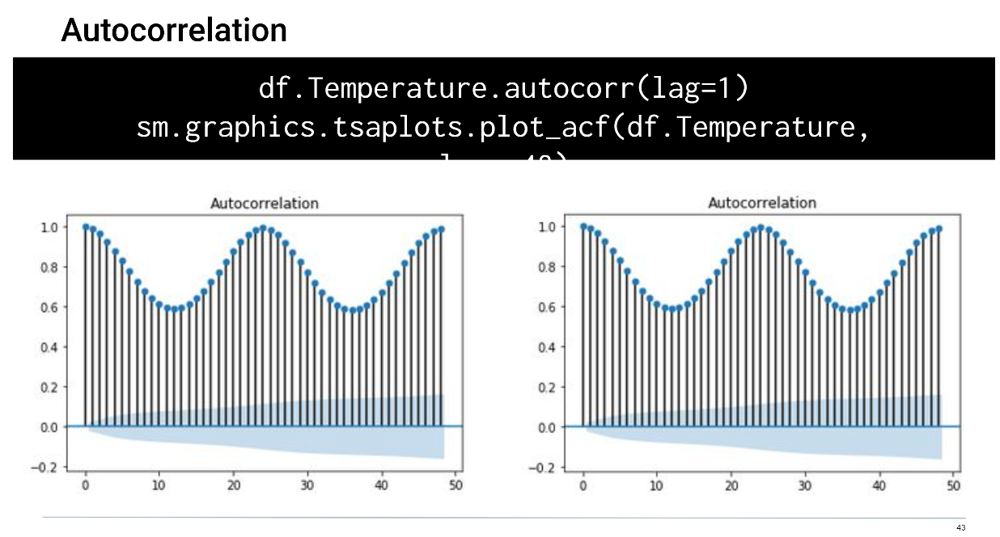
        
     8. Time Series Statistical Models
        - Stationary vs Non-Stationary Data   
  

        - Auto-Regressive Models 
            - Main Points
                - 01 - Past values are used to predict future values
                - 02 - Therefor assumes some degree of autocorrelation
                - 03 - An AR model may have on significant lag, or it may have multiple
            - First-order AR Model
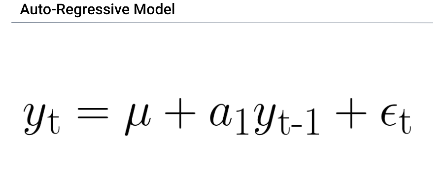   
            
            - Second-order AR Model   
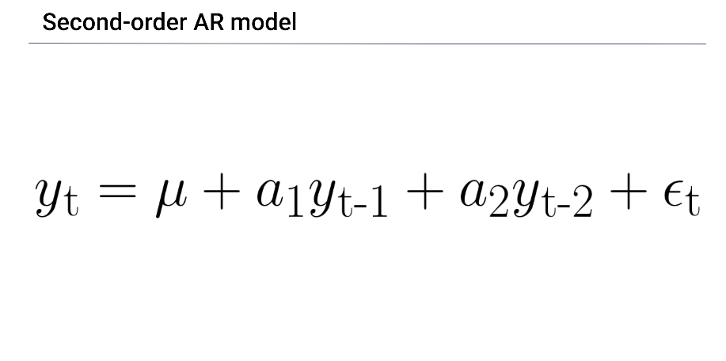       

            - An AR Model predicts future values based on:
                - 01 - Pass values at a specified lag
                - 02 - The number of Lags
                
        - Moving Average Model
            - Past Errors (plus current error) are used to predict future values
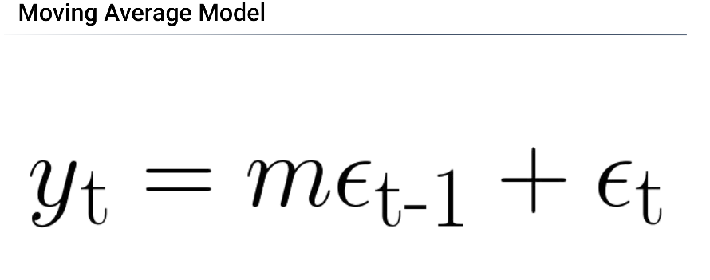
        
        - ARIMA Model
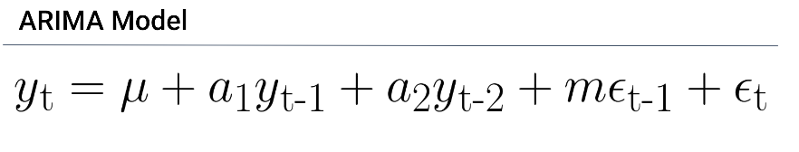  

        - Volatility
            - High volatility can affect prices (higher volatility = more risk)
            - By understanding volatility on can construct a more diversified portfolio
                - [bonds, funds, shares, algos, etc..]
            - Derivitatives are particularly sensitive to volatility
            
        - Model Selection
            - Asses how well a model fits the data (goodness of fit), and complexity
            - higher-order odels are penalized for complexity
            - lower scores the better
            - Model Selection Types
                - AIC
                    - is an estimator of out-of-sample prediction error and thereby relative quality of statistical models for a given set of data.[1][2] Given a collection of models for the data, AIC estimates the quality of each model, relative to each of the other models. Thus, AIC provides a means for model selection.
                    - AIC is founded on information theory. When a statistical model is used to represent the process that generated the data, the representation will almost never be exact; so some information will be lost by using the model to represent the process. AIC estimates the relative amount of information lost by a given model: the less information a model loses, the higher the quality of that model.
                    - in estimating the amount of information lost by a model, AIC deals with the trade-off between the goodness of fit of the model and the simplicity of the model. In other words, AIC deals with both the risk of overfitting and the risk of underfitting

                - BIC
                    -  is a criterion for model selection among a finite set of models; the model with the lowest BIC is preferred. It is based, in part, on the likelihood function and it is closely related to the Akaike information criterion (AIC).
                    - When fitting models, it is possible to increase the likelihood by adding parameters, but doing so may result in overfitting. Both BIC and AIC attempt to resolve this problem by introducing a penalty term for the number of parameters in the model; the penalty term is larger in BIC than in AIC.
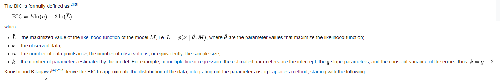  

        - Garch Models
            - used to predict volatility
            - Like ARMA, GARCH also has auto-regressive and moving average components
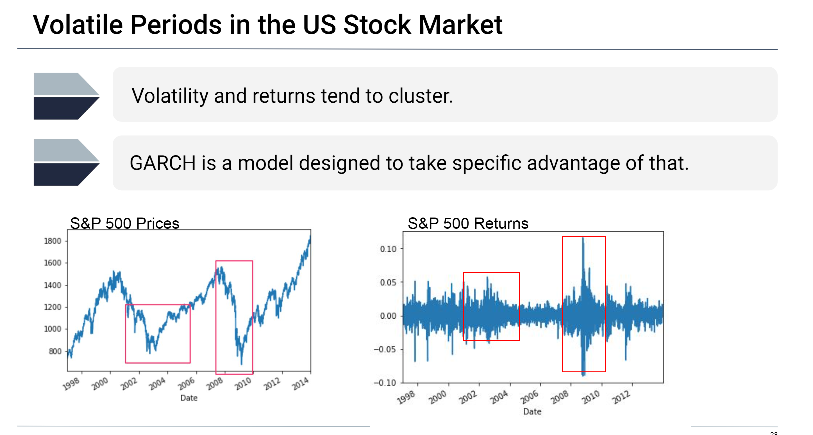  

    9. Time Series Regression
        - Linear Regression: Finds the line that best describes the Data
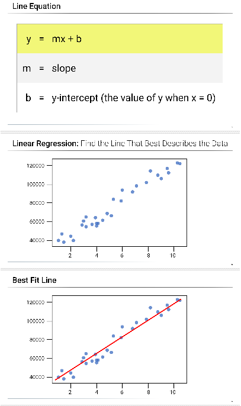

        - Multiple Regression: Each Day X is assigned its weight or coefficient
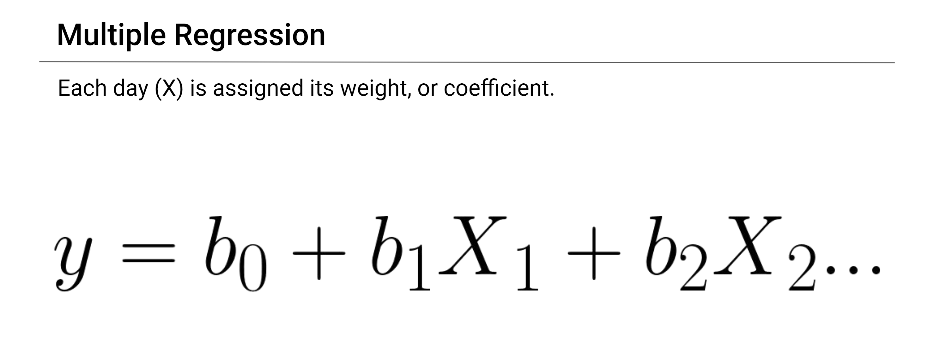       

        - Regression Metrics
            - Best fit line
            - minimize error
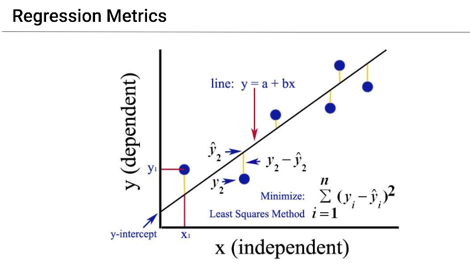  

        - Overfitting: Overfit models learn the 'noise' found in the training data, rather than just the 'signal'  
        
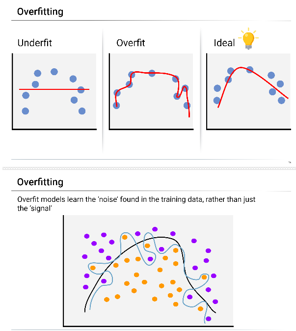  

        - Variance vs. Bias
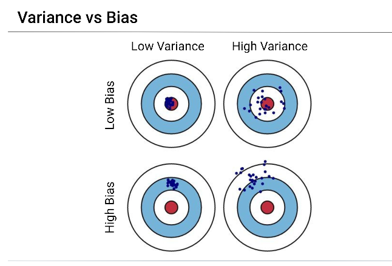  

        - Parsimony
            - Statistical application of Occam's razor: when two models perform similarly, choose the simpler one because needlessly complex models are harder to compute and may lead to overfitting.
            
        - Rolling Out-ofSample Approach
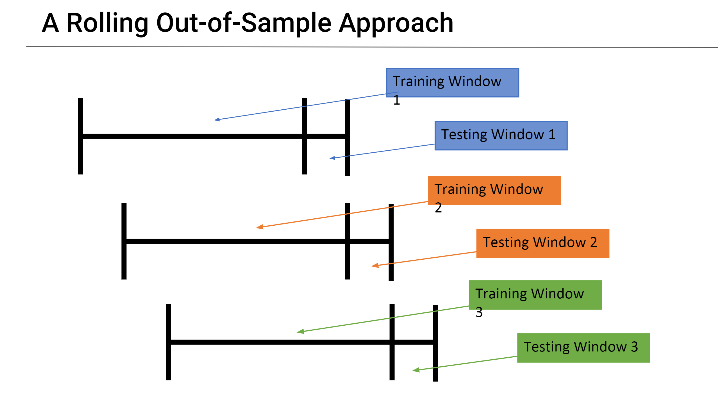

        

### Possible Timeseries Datasets

## Athlete Optimization
- Weight over time
- power over time
- speed over time
- calories expended over time
- ECG 
- EEG
- Hydration